# Bubble Blast Saga

## About

### The classic bubble shooter game for the iPad!
Runs on a simplified self-made game engine, and applies the MVC architectural pattern.  
Made as part of NUS CS3217 Problem Set 3, 4 and 5.

## Screenshots
### Have a look at some screenshots!

### Menu
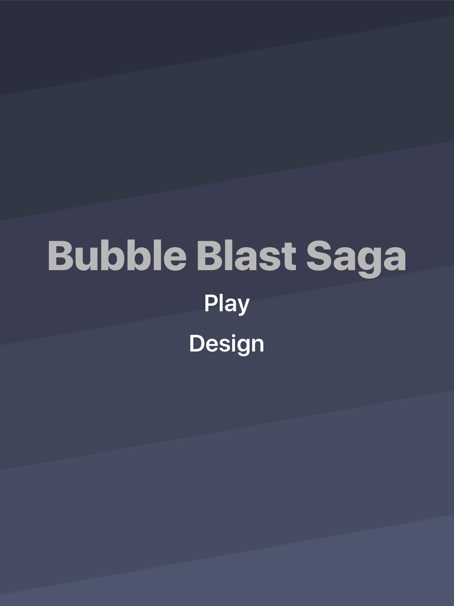

### Level Selection

### Level Designer
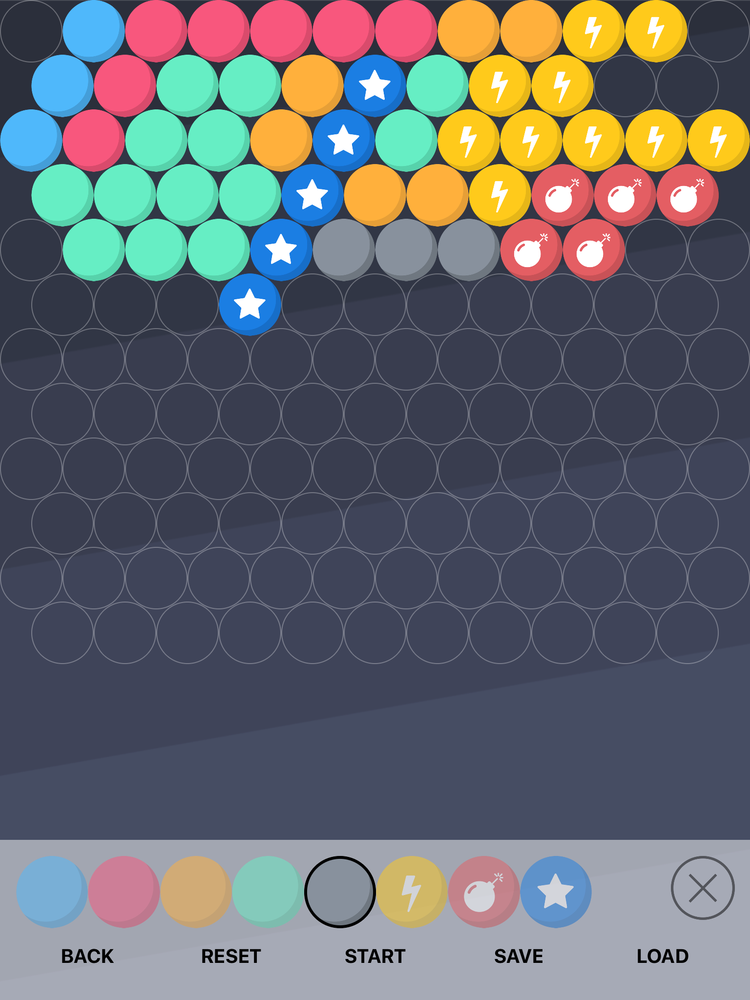
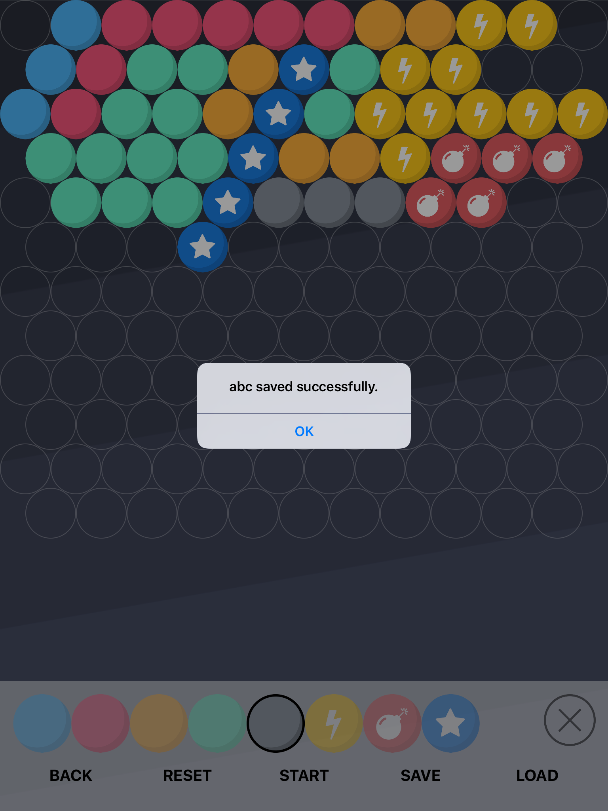
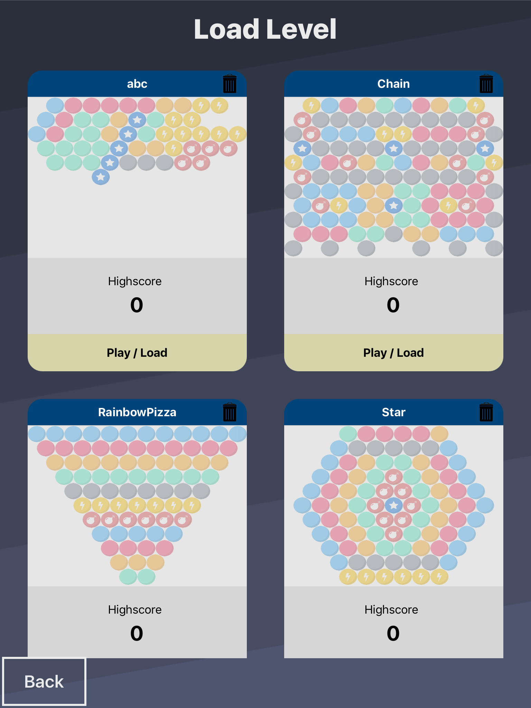

### Gameplay
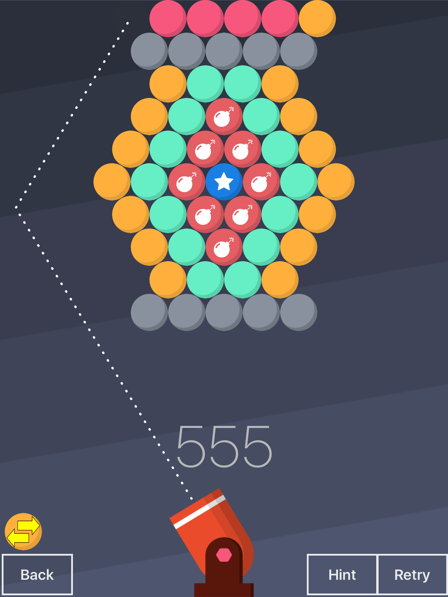
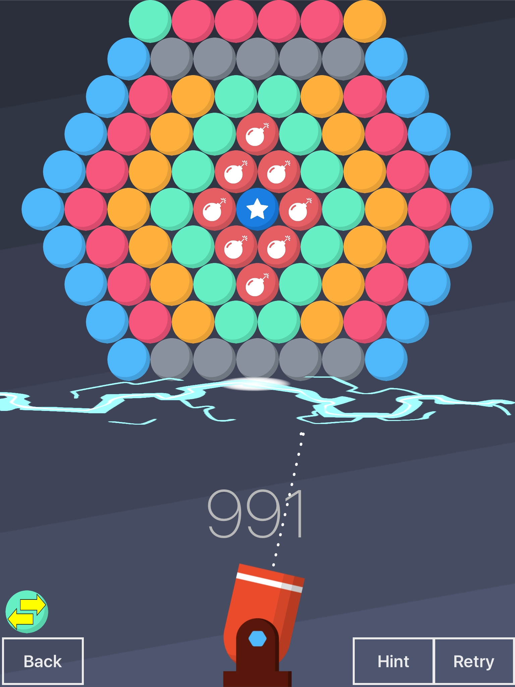
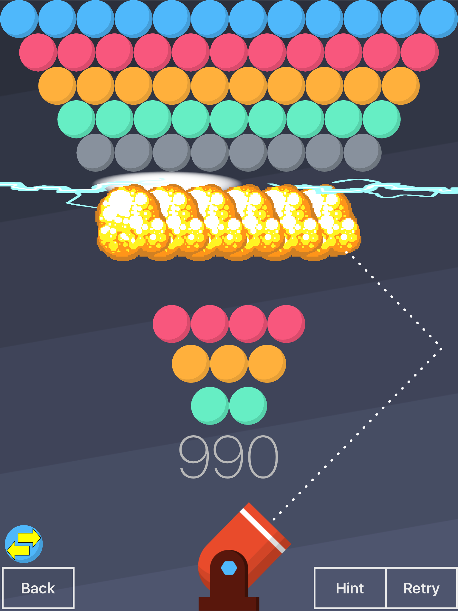
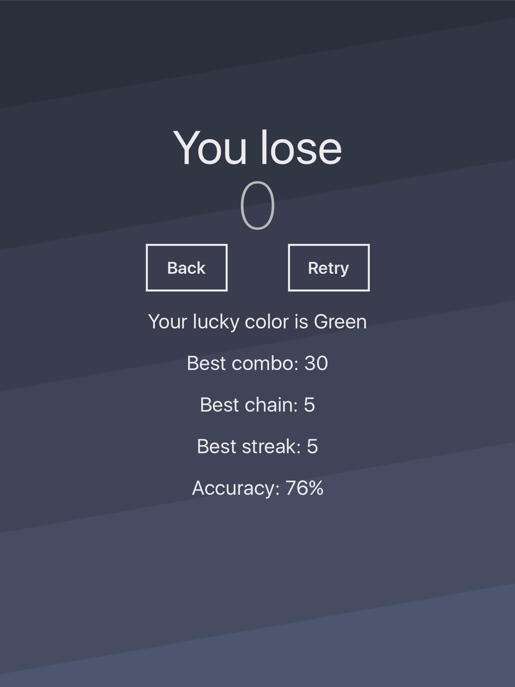

### Hint System
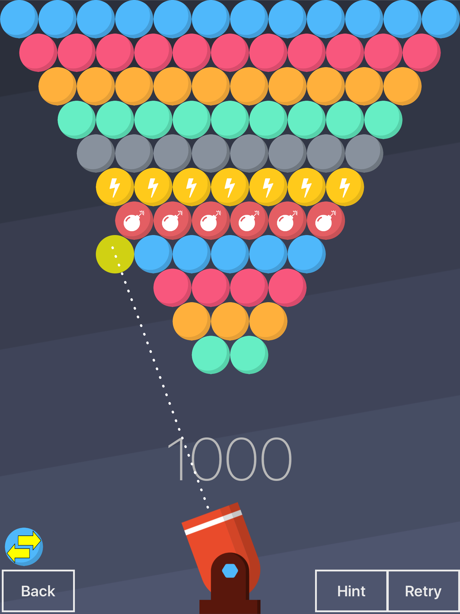
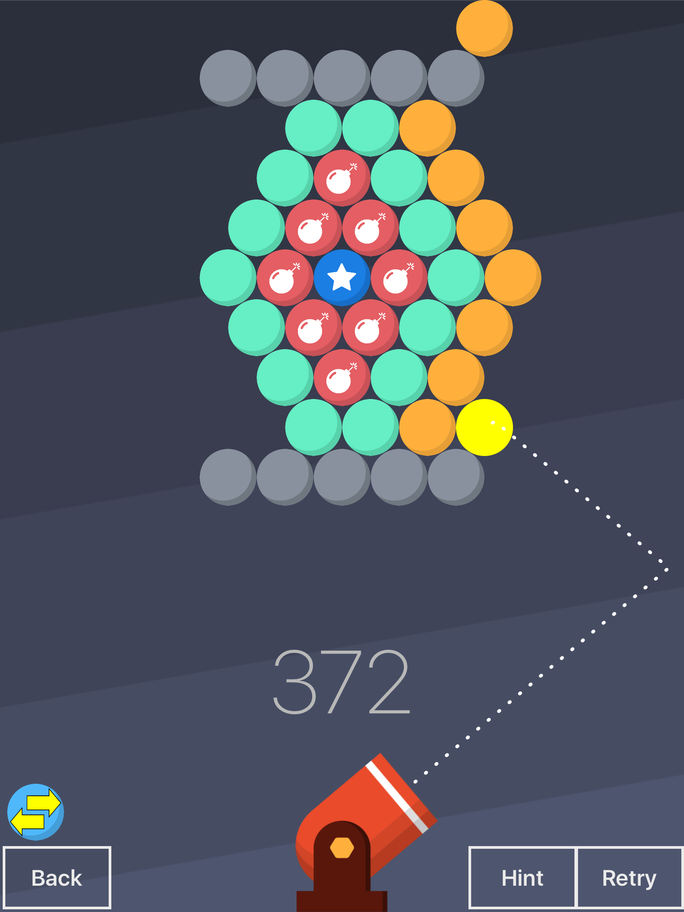
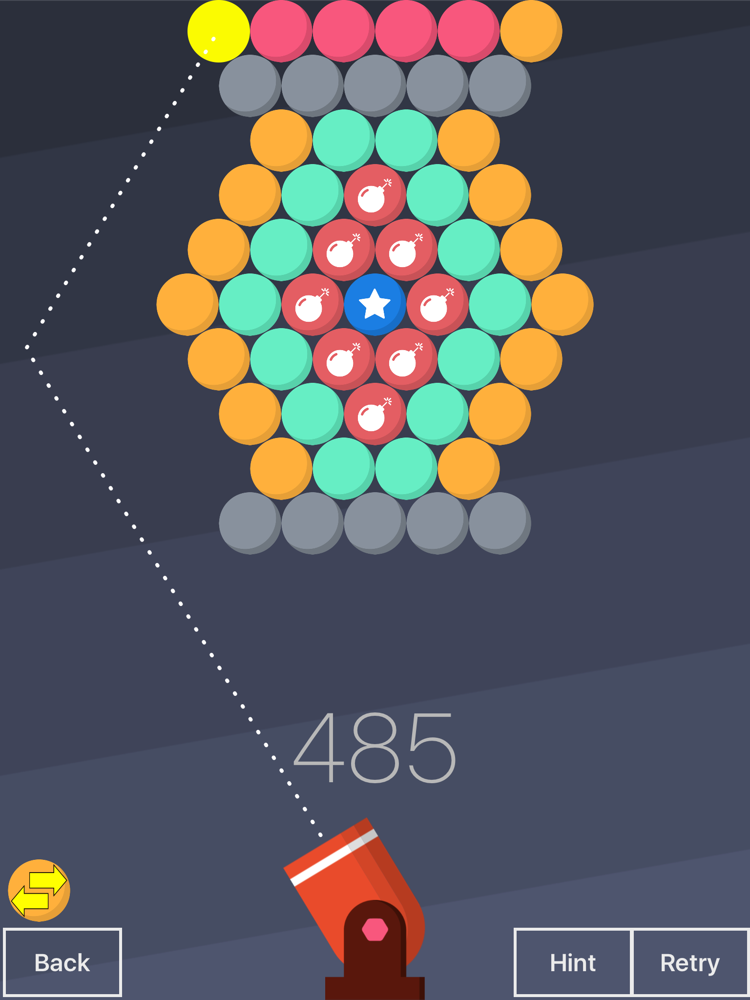

## Features
### Classic features
* Bubble popping
	* Shoot bubbles from a cannon and connect a group of at least 3 similarly colored bubbles to pop them
* Game score
	* Clear the level as fast as possible!
	* Score is correlated to the time taken
	* High score is tracked and updated seamlessly
* Retry button
	* Restart the level for another attempt
* Special bubbles activated by shooting a bubble at them
	*  *Effects of special bubbles can be chained to activate even more special bubbles*
	* 	Indestructible bubble - Cannot be popped or destroyed, can only be removed by dropping
	*  Lightning bubble - Destroys all bubbles in the same row as it
	*  Star bubble - Destroys all colored bubbles that are the same color as the bubble that activated it
	*  Bomb bubble - Destroys all adjacent bubbles around it
*  Level Designer
	*  Create custom levels that can be saved and loaded to be played in the game
*  Level selection menu
	*  Displays all levels saved on the device
	*  Levels displayed with highscore and image preview of the level

### Special features
*  Aiming guide
	*  Displays the trajectory path that the bubble will follow while user is aiming to allow users to fine tune their aim
*  Hint system
	*  Provides a hint of where to fire the next bubble in order to maximize the number of bubbles removed
	*  Automatically computes the best angle and location to land the current bubble in
	*  The hint displays the angle to fire and the location the bubble will land by drawing the trajectory path similar to the aiming guide above
*  End game statistics
	*  Best combo achieved (maximum number of bubbles popped in one go)
	*  Lucky color (color that led to the best combo)
	*  Best chain count
	*  Best removal streak
	*  Shot accuracy
*  Swap button
	*  Swap the current bubble with the upcoming bubble

## Implementation
Disclaimer: The following is a description of how I designed certain features / implementations and might not be the *best* way of doing them. Hopefully this might be useful for those who wish to implement something similar on their own / future batches of CS3217, but have no idea how to approach these features.

### Aiming guide
I ran a simulation of the movement of a game bubble, as if it were really fired and traced the movement of the bubble. For this to work, we need a special bubble class so that we can ignore any possible interactions with the actual bubble grid bubbles, since it is just a simulation to draw the path and we don't actually want to affect the game grid.  

1. When the user aims the cannon, fire the simulation bubble and use the physics engine to manually step through the movement of the simulation bubble. You probably need to modify the physics engine to be able to do this. 
2. After each update step of the physics engine, add the current simulation bubble position to an array. 
3. Stop the simulation when the simulation bubble is stationary or the maximum simulation steps is reached. The maximum simulation steps is to prevent lag as there are certain angles where the simulation bubble will take a long time to reach a stopping point (snapping to grid) and your UI will be very laggy. My maximum was set to **100** but you can adjust this accordingly.
4. Use the array of points to draw a bezier path connecting those points and this will achieve the aiming guide effect.

### Hint system

First, to calculate the best position to land a bubble, I run a BFS from the bottom-most empty row in the grid, visiting only other empty adjacent neighbours. For each visited position, I add it to an array of candidate positions if there is at least one adjacent bubble beside it. 

For each candidate position, I run a simulation on the interactions of having the bubble at that position and determine the number of bubbles removed in that candidate position. I take the candidate position with the maximum removals as the ideal position.

*One thing to note is that this system uses a kind of greedy approach and does not always guarantee a solution. E.g. There is no ideal position if none of them can remove any bubbles at all. You can work around this by perhaps suggesting to user to swap his current bubble, even possibly running the simulation on the swapped bubble instead, or just inform the user that there is no ideal position.*

The next step is calculating the angle to get the bubble to land in that ideal position, and this is the hard part. This requires some knowledge of geometry involving similar triangles.

**There are only 3 angles to be concerned with in trying to get the bubble to the ideal position:**

1. Direct angle
2. Rebound from the left
3. Rebound from the right

For each of these angles, we need to run the simulation to check if the bubble can actually reach the ideal position using the angle. In the best case, the ideal position can be reached directly if it is not blocked by any bubbles using a direct angle. However, there are cases where we need to use a rebound instead. The following describes how to compute a rebound angle from the left, but a similar concept can be applied for the right as well. 

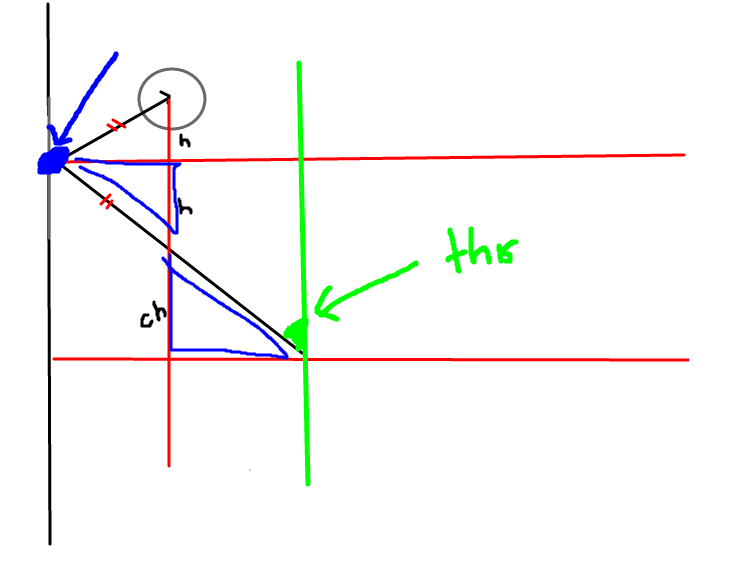

What we want is the angle in green, and we can compute that easily if we have the coordinate in blue. 

> Observe that there exists a pair of similar triangle highlighted in blue in the figure above. The upper triangle has a height `h`, while the lower triangle has a height `ch` where `c` is some constant.  
> Furthermore, there also exists an isosceles triangle at the top.

1. Compute horizontal distance (x-axis), `w2`, from ideal bubble position to the wall. 
	* Remember to account for the radius of the ball (subtract radius of bubble from horizontal distance computed) as the bubble's centre does not actually land on the wall!
2. Compute horizontal distance (x-axis), `w1`, from cannon starting position to the center of the ideal bubble position.
3. Obtain the ratio `r = w1 / w2`. 
	* This ratio `r` is equivalent to the constant `c`.
4. The vertical height from the starting position to the ideal bubble position, as seen from the diagram is given by `ch + h + h = h(2+c) = h(2+r)`.
	* But this vertical height is simply `idealPosition.y - startPosition.y`. 
	* Thus `idealPosition.y - startPosition.y = h(2+r)`.
	* Rearranging gives us: `h = (idealPosition.y - startPosition.y)/(2+r)`.
5. With `h`, we can obtain the y-coordinate of the blue rebound position by simply taking `idealPosition.y - h`.
6. The x-coordinate of the blue rebound position is simply the wall's x-coordinate + taking into account the radius of the ball.

## Acknowledgements
I would like to thank the CS3217 teaching team (AY 2016/17 SEM 2) for their hard work in preparing the problem sets and their timely feedback, which has helped to culminate in this final complete game.